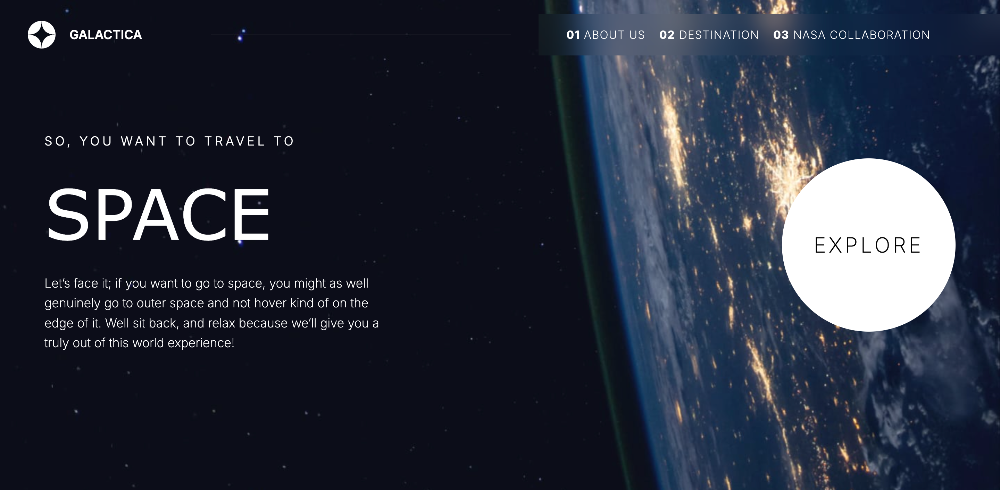

# Galactica Space Travel App

## Introduction
Galactica is a space travel application built with Next.js and React. This project aims to teach students the fundamentals of React and Next.js by creating a dynamic and interactive space exploration app.

## Prerequisites
- Node.js (version 18 or higher)
- npm or yarn

## Getting Started

### Installation
1. Fork the repository (Recommended)
2. Clone the repository using Code > Clone

Now you should have to project on your computer.

3. cd into the homework folder
4. run `npm install`

### Running the Development Server

`npm run dev`

Open your browser and navigate to http://localhost:3000 to see the app in action.

### Screenshots

